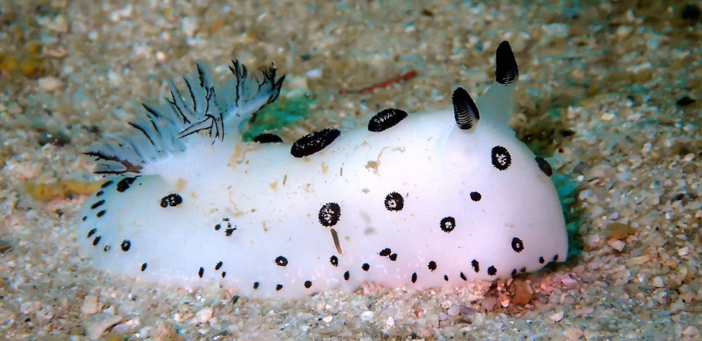

# Nudibranchs - Patricia Alessandrini - Une production Le Fresnoy – Studio national des arts contemporains.




This repository contains a [SOFA](https://github.com/sofa-framework/sofa) simulation of a Nudibranch like soft robot designed by Patricia Alessandrini. 
Images of the simulation can be found in the `image` directory. To run the simulation, follow the requirements and instructions below. 

## Requirements

Minimum OS and python requirements:
- **OS**: Windows 10, Ubuntu 22.04, MacOS 12
- **Python**: 3.10

## Install SOFA 

Download SOFA and the following plugins. Checkout the `master (or main)` branch if not specified otherwise. 

From _github.com/sofa-framework_:
- [SOFA](https://github.com/sofa-framework/sofa) 
- [SofaPython3](https://github.com/sofa-framework/SofaPython3) 
- [CGALPlugin](https://github.com/sofa-framework/CGALPlugin)
  
From _github.com/SofaComplianceRobotics_:
- [SofaGLFW](https://github.com/SofaComplianceRobotics/SofaGLFW/tree/robotics) on the **robotics** branch
- SofaImGui (distributed with SofaGLFW)

From _github.com/SofaDefrost_:
- [SoftRobots](https://github.com/SofaDefrost/SoftRobots) 
- [SoftRobots.Inverse](https://github.com/SofaDefrost/SoftRobots.Inverse)
- [STLIB](https://github.com/SofaDefrost/STLIB) 
 
Once you have downloaded everything, you can follow the instructions detailed [here](https://www.sofa-framework.org/download) to build SOFA with the plugins.

## How to

To run the simulation, open a terminal in the folder `LeFresnoy.Nudibranchs` and run the following command:
```console
PATH_TO_SOFA_BUILD_DIRECTORY/bin/runSofa -l SofaPython3,SofaImGui -g imgui scene.py
```
